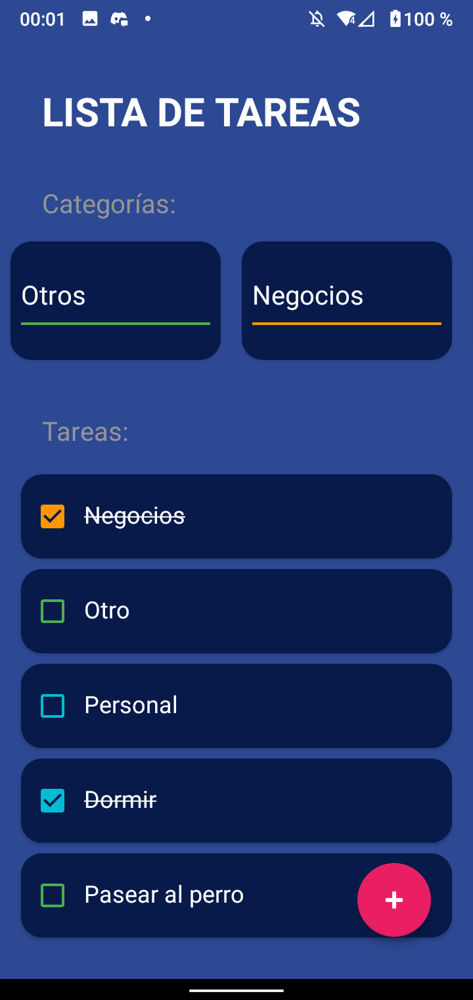

# CRUD básico
Una aplicación de CRUD, es decir una aplicación que permite crear, leer, actualizar y borrar datos. 

Elementos utilizados en esta aplicación:
* RecyclerView
* Dialogs
* Sealed Class
* Funciones lambdas para eventos de un elemnto de un RecyclerView
* Diseño de UI
* CardView
* Gestión, creación y utilización de recursos(strings, color, themes)

|                               Pantalla principal                               |                                   Resultado                                    |
|:------------------------------------------------------------------------------:|:------------------------------------------------------------------------------:|
|    |    |